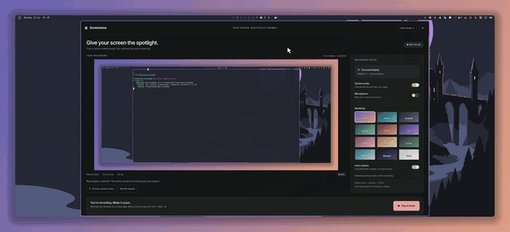

<div align="center">

# Screenema

**Give your screen the spotlight.**

A cinematic screen recorder for [Omarchy](https://omarchy.dev) and Hyprland.
Press record, work normally, and get back one finished MP4 where the camera
moves like someone was actually filming you.

`Rust` · `Cairo` · `GTK 4.10` · `MIT`



</div>

---

## The idea

Most screen recorders are a rectangle that follows your cursor. Screenema is a
small virtual camera operator sitting on top of your capture.

- You click, and the camera **eases in on that spot** — a deliberate move, not a
  jump cut.
- While you keep working, it **holds**, then **eases back out**. The full zoom is
  a plateau, never a one-frame spike.
- A burst of clicking across the screen plays as **one continuous move**. The
  camera follows you between targets instead of resetting on every click.
- Then it rests in the overview, and does it all again on the next click.

Everything is local. No upload, no account, no telemetry.

---

## Quick start

```sh
cargo run --release
```

You'll need **GTK 4.10+**, **Hyprland**, **FFmpeg** with libx264, and **GPU
Screen Recorder** with `-write-first-frame-ts` support. `grim` provides the
display snapshot preview, and GTK's media backend handles playback.

<details>
<summary>Not on Omarchy?</summary>

Screenema talks to Hyprland for monitor geometry and shells out to
`gpu-screen-recorder` for capture, so those are hard requirements regardless of
distribution. The Polkit agent used for mouse authorization ships with Omarchy's
shell; on other desktops you'll need any graphical Polkit agent running.
</details>

---

## Recording a take

1. **Pick a backdrop** and your audio sources.
2. **Turn on Auto camera.** This opens the system mouse-access prompt — the same
   dialog you'd see for any other privileged action. Screenema never sees or
   handles your password. Approve it and you get click-triggered zooms; cancel
   and you get pause-based zooms instead. Approval lasts for the session,
   including later takes.
3. **Start recording.** There's a cancellable three-second countdown, so minimize
   Screenema for a clean take.
4. **Work.** Clicks and pauses are captured live.
5. **Stop & finish.** Or press `Ctrl+Shift+R` while the window has focus.
6. **Watch it** in the app, or hit **Open video** for your usual player.

Two buttons are worth knowing before you start:

| Button | What it does |
| --- | --- |
| **Preview camera move** | Demonstrates a cross-screen camera move on a snapshot of your *actual* display |
| **Refresh display** | Briefly hides Screenema and takes a new snapshot |

---

## The camera

Every shot is three phases, not one curve:

```
zoom in                hold                zoom out
500ms                  600ms               800ms
    ╱‾‾‾‾‾‾‾‾‾‾‾‾‾‾‾‾‾‾‾‾‾‾‾‾‾‾‾‾‾‾‾‾‾‾‾‾‾‾‾‾‾╲
  ╱                        ╲___                    ╲
────                                    ────
overview                                                   overview
```

### How a click becomes a shot

With mouse access granted, clicks **no more than 2.5 seconds apart** are grouped
into a single shot:

- The shot **reaches full zoom on its first click**, so the zoom is already
  settled at the exact moment you act.
- Every later click in the cluster **re-arms the dwell**. This is why a burst of
  clicking never makes the camera twitch back to the overview.
- The release begins **600 ms after the last click**, so the zoom is still there
  while the click's effect registers on screen.
- A click that lands *during* the release eases back in rather than dropping out.
- A cluster is fully released 1.4 s after its last click, and the next one can't
  begin before 2.0 s, so two shots can never overlap or fight each other.

Without mouse access, a **450 ms cursor pause** triggers a zoom instead, and takes
shorter than three seconds stay in the overview. Either way, the camera follows
your movement once it's zoomed in.

### Staying steady while zoomed

- A **25% inset safe zone** means small pointer movements don't move the camera at
  all.
- Leave that zone and the focus follows with a **near-critically damped spring**,
  so it arrives without wobbling.
- The camera **stops following during the zoom-out**, so the return doesn't chase
  your cursor across the screen.
- Nearby activity **extends the current zoom** rather than queueing a delayed shot
  behind it.
- It transforms the **whole composition** — screen edges, shadow, and cursor all
  move together. It is not a crop sliding around inside a fixed frame.

Preview and export share one compositor and one camera planner, so what you
rehearse is what you get. Camera frames are baked at 60 fps, which means seeking
backwards in the player follows the exact path the export took.

### On native pixels

The overview keeps source pixels at **1:1**. Padding *increases* the output canvas
rather than shrinking your capture, so text is never resampled to fit. GPU capture
uses the ultra quality preset; the export is H.264 CRF 12 at 60 fps with AAC audio.
The MP4 uses 4:2:0 color for player compatibility, so very fine colored details can
still lose some chroma fidelity.

Twelve gradient backdrops ship built in:

`Dusk` · `Ocean` · `Graphite` · `Aurora` · `Ember` · `Iris` · `Rose` · `Sand` · `Forest` · `Glacier` · `Midnight` · `Pearl`

> No timeline editor and no manual zoom-region editing yet.

---

## Mouse access, honestly

Click-triggered zooms need to know when you click, which means reading raw input
events. That requires root, so here is exactly what happens:

- Screenema invokes `pkexec` and shows **the system authorization dialog**. It never
  asks for, receives, or stores your password.
- Nothing is installed. **No groups, udev rules, or device permissions change.**
- The `--click-helper` process opens only devices that advertise mouse buttons,
  applies **kernel event masks that exclude keyboard keys and other payloads**,
  then **drops root privileges** and disables future privilege elevation.
- It holds those handles for the app session and nothing longer. There is **no
  always-running service**.
- Button-press timestamps are sent **only during a recording**; idle events are
  discarded when the next take starts.

If you cancel the prompt, pause-based zooms remain available. If a mouse
disconnects or the helper fails, the current take falls back to pause-based zooms
and tells you why — toggle Auto camera off and on to retry. Mice connected later
need reauthorization after a restart.

This reads **physical mouse buttons**. Compositor-generated touchpad taps and
synthetic clicks are not detected.

---

## Files

| | |
| --- | --- |
| **Finished video** | `~/Videos/OmaScreenema/` — one file per successful take |
| **Temporary capture, log, first-frame timestamp** | `$XDG_CACHE_HOME/oma-screenema/` (normally `~/.cache/oma-screenema/`) |
| **After a successful export** | Temporaries are deleted, but only *after* the final MP4 is verified |
| **After a failed export** | Recovery data is kept, and any prior finished video is left untouched |

Existing recordings are never swept or deleted.

Export uses CPU compositing and encoding, so full-resolution camera effects can
take longer to render than the recording itself. Recordings and display
snapshots stay on your machine.

---

## Development

```sh
cargo test
cargo clippy --all-targets -- -D warnings
```

Both must pass. The suite covers authorization denial, idle filtering, repeated
takes, helper shutdown, keyboard-event rejection, click/video alignment, click
clustering, click-triggered exported frames, the dwell after a click, click
bursts that stay zoomed and follow, late target handoffs, safe-zone stability,
following during movement, seek independence, frozen zoom-out focus, all twelve
backdrops, and actual rendered frame boundaries during zoom, return to overview,
one-pixel detail retention, audio and frame-rate preservation, scaled/rotated
monitor coordinates, timing alignment, and temporary-file cleanup. A failed
export must preserve recovery data and any prior finished video.

Some tests render real video through FFmpeg and are slower than the rest.

### Credits

The behavior reference is
[Recordly](https://github.com/webadderallorg/Recordly/tree/4fda917aff39729eb22e72bbb881c6b7123d4033),
specifically `cursorFollowCamera.ts`, `sceneMotion.ts`, `motionSmoothing.ts`, and
`zoomSuggestionUtils.ts`. This Rust/Cairo implementation takes its safe-zone and
spring-motion principles from there. Click clustering uses the same 2.5 s gap;
the phase durations and transition curve are this implementation's own.

---

## Demo

The GIF above is a real take, re-encoded to 640px/15fps from a 2724×1244 60fps
capture. Nothing is staged: watch the framing ease in on the terminal, hold
while the work continues, then release. The zoom is at its peak for a beat, not
a single frame.

If you want the full-resolution original, record your own take — it lands in
`~/Videos/OmaScreenema/`.

---

<div align="center">

**MIT licensed.** Recordings never leave your machine.

</div>